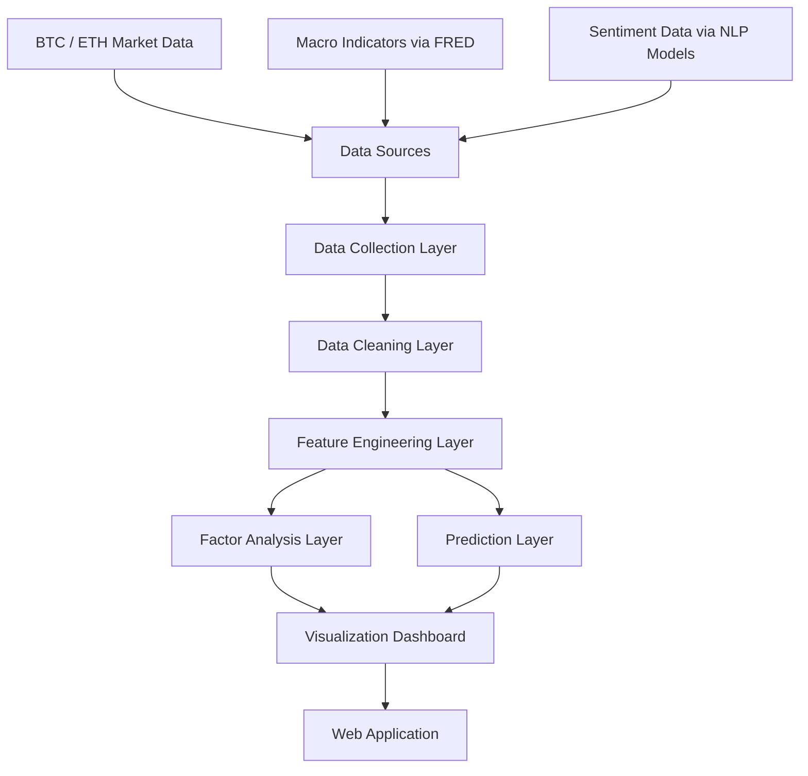

# CryptoSight System Architecture

## Layers

- Data Sources: Binance, CoinGecko, CoinMarketCap, FRED, news, Twitter/X, Reddit.
- Data Collection Layer: ETL jobs and API collectors.
- Data Cleaning Layer: missing values, outlier clipping, interpolation.
- Feature Engineering Layer: RSI, MACD, moving averages, volatility, lagged features.
- Factor Analysis Layer: correlation, Granger causality, feature importance, SHAP.
- Prediction Layer: ARIMA, Prophet, Random Forest, XGBoost, LSTM.
- Visualization Dashboard: market overview, macro trends, sentiment, factors, prediction center.
