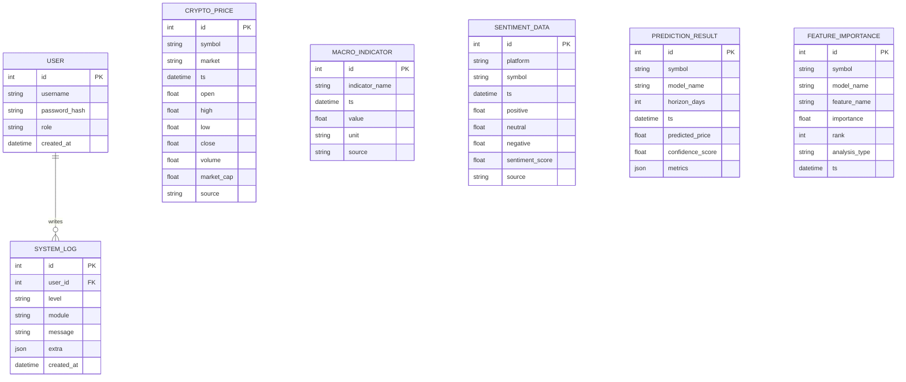

# CryptoSight ER Diagram

## Notes

- `crypto_price`, `macro_indicator`, and `sentiment_data` are time-series fact tables.
- `prediction_result` stores model outputs for each forecast horizon.
- `feature_importance` stores ranking results for thesis figures and reports.
- `system_log` records operational events and user actions.
